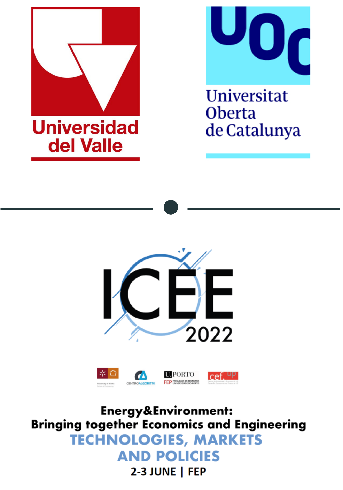
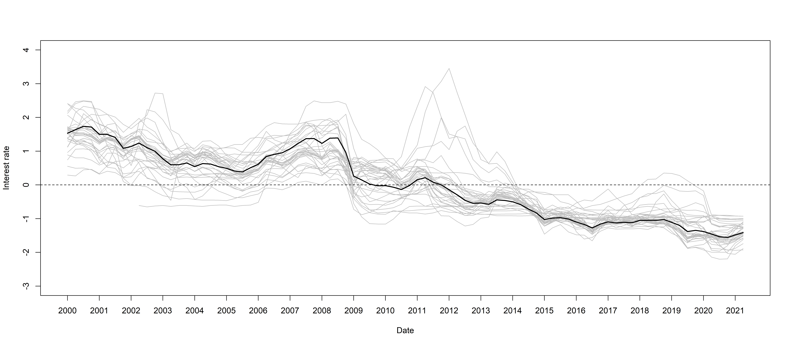
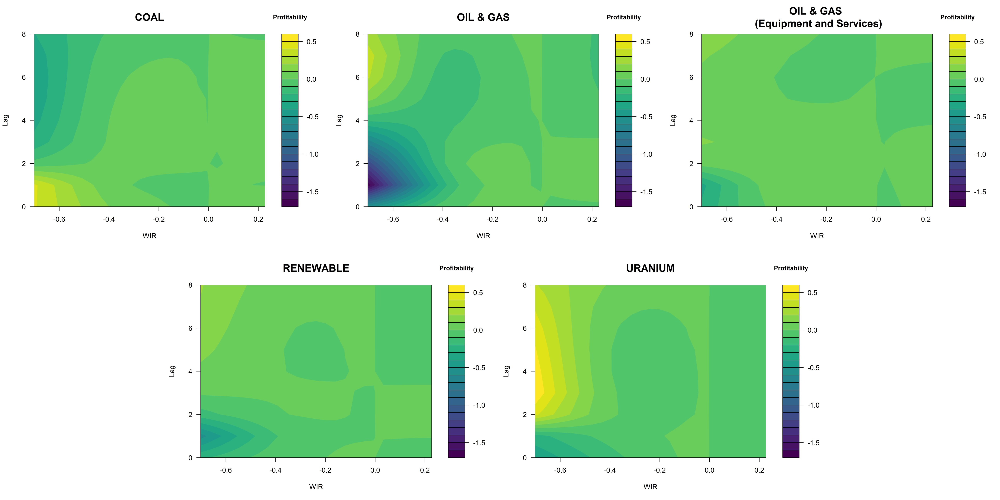
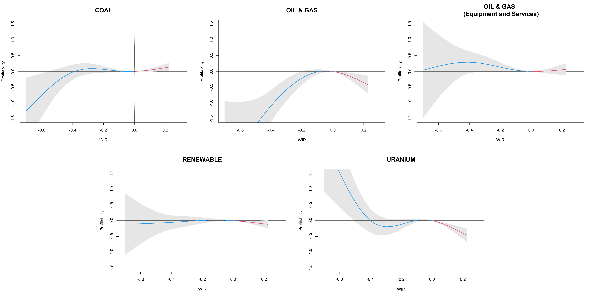

```{r setup, include=FALSE}
library(knitr)                              # paquete que trae funciones utiles para R Markdown
library(tidyverse)                          # paquete que trae varios paquetes comunes en el tidyverse
library(datos)                              # paquete que viene con datos populares traducidos al español :)
library(shiny)
# opciones predeterminadas
knitr::opts_chunk$set(echo = FALSE,         # FALSE: los bloques de código NO se muestran
                      dpi = 300,            # asegura gráficos de alta resolución
                      warning = FALSE,      # los mensajes de advertencia NO se muestran
                      error = FALSE)        # los mensajes de error NO se muestran


options(htmltools.dir.version = FALSE)

```

```{r xaringan-panelset, echo=FALSE}
xaringanExtra::use_panelset()
xaringanExtra::use_share_again()
```


class: clear


.pull-left[

.center[

<br><br>

```{r echo=FALSE, out.width = "75%" }

```

]
]


.pull-right[


.center[


[PhD. Student. Orlando Joaqui-Barandica](https://www.joaquibarandica.com) <br/>
Universidad del Valle
]


.center[


[PhD. Diego F. Manotas-Duque](http://industrial.univalle.edu.co/profesores/diego-fernando-manotas-duque) <br>
Universidad del Valle
]

.center[


[PhD. Jorge M. Uribe](https://jorgemuribe.com/) <br>
Universitat Oberta de Catalunya
]

]


???

•	Diapositiva 1 - Saludo

Hello, Good morning. Thank you very much for attending my presentation. It is a pleasure to be here and share with you.
Today, I'm going to talk about Global liquidity and the profitability of energy firms. In advance, I apologize for my English.


•	Diapositiva 2 – Autores

This research is carried out in conjunction with, Professor Diego Manotas from the Universidad del Valle, and Professor Jorge M. Uribe from the Universidad Oberta de Cataluña.


<!-- --- -->


<!-- class: contenido -->

<!-- <div class="my-logo-right"></div> -->


<!-- # Content -->


<!-- .pull-left[ -->

<!-- </br> -->

<!-- ###  `r icon::fa("circle-notch", animate = "spin")` [Motivation](#Motivation) -->


<!-- ###  `r icon::fa("circle-notch", animate = "spin")` [Energy profitability literature](#Literature) -->


<!-- ###  `r icon::fa("circle-notch", animate = "spin")` [Methodology & Data](#Methodology) -->


<!-- ###  `r icon::fa("circle-notch", animate = "spin")` [Results](#Results) -->


<!-- ###  `r icon::fa("circle-notch", animate = "spin")` [Conclusion](#Conclusion) -->

<!-- ] -->

<!-- .pull.right[ -->

<!-- ] -->


<!-- ??? -->

<!-- •	Diapositiva 3 – Contenido -->

<!-- This is the content that I will expose today: We will begin with a brief introduction or motivation to the research topic. -->


<!-- Secondly, I will present some works consulted on energy profitability. Subsequently, I will present the methodology carried out in the empirical work and, finally, I will show the results and conclusions of the research. -->


<!-- --- -->

<!--name: Motivation -->

<!-- class: inverse, mline, center, middle -->
<!-- <div class="my-logo-center"></div> -->


<!-- # Motivation -->

<!-- ??? -->

<!-- Diapo 3: Transición -->

<!-- Talking a little about the motivation for this work... we have... -->


---

<div class="my-logo-right"></div>

# Motivation

<br><br>

.pull-left[

.font120[
* Understanding the determinants of companies’ profitability is of utmost importance for both, academics and corporate managers.

* Different empirical and theoretical studies show that profitability depends on external conditions, industry scope and specific firms’ characteristics `(Wieczorek-Kosmala et al., 2021)` 
]

]

.pull-right[

.center[


.font120[
`External determinants` vs. `Internal determinants`
]

]

]


???

Diapo 3: Motivación


Understanding the causes or generation of company profitability is a topic of interest in the academic and business world. 

Although, different companies may in turn present different causes or events that determine their profitability, depending on the structure of assets, or financial structure or operations or composition of assets. 

We could mainly identify two foci of the determinants.

In the first place, the internal determinants are associated with the characteristics of the companies. And secondly, the external determinants are associated with aspects that are not controlled by the company's management but that clearly influence decision-making or management strategies.


---


<div class="my-logo-right"></div>


# Motivation

.left-column[

## Profitability... 

... is defined as the ability to take advantage of resources to generate profits, therefore, as an indicator of effective management.
]


.right-column[

## Idiosyncratic characteristics vs. Common forces

.font120[
Identifying the determinants of profitability and anticipating its fluctuations guarantees timely and informed decision-making that maximizes value for the company’s stakeholders.


.pull-left[
**Internal determinants**
* `Firms’ age`
* `Size`
* `Financial leverage`
* etc.
]


.pull-right[
**External determinants**
* `Fuel prices`
* `Interest rates`
* `Exchange rates`
* `Economic activity`
* etc.

]

]

]

???

Diapo 4: Motivación

The importance of profitability lies in its relevance as an indicator of efficient management in terms of utility and benefit for companies. 

In the case of the energy companies, we found a big difference in their composition and management strategies, mainly by the sources of generation as to oil, wind, water or solar. This generates different strategies to maximize the value of the companies due to their operation.

Different authors have identified Internal aspects or idiosyncratic characteristics as firms' age, or size, financial leverage, etc., and the external determinants can be fuel prices, interest rates, exchange rates, economic activity, etc. Many other internal and external measurable characteristics can be listed.


---


<div class="my-logo-right"></div>


# Motivation


.font180[**Here...**]

.right[

<br>

.font180[... we analyze the external determinants of the profitability of energy firms, and specifically, the effect of `global liquidity` on the profitability of companies belonging to different energy sub-sectors]

]

<hr>

<br>

.font120[
`r anicon::faa("angle-double-right", animate = "passing")` Our working hypothesis is that changes of `global interest rates` (and hence of funding liquidity) have important effects on the financial operation of large energy firms.
]


???

Diapo 5: Motivación

We focus on analyzing the external determinants. Specifically the global liquidity that we measure from interest rates.

Our working hypothesis is that changes in global interest rates have important effects on the financial operation of large energy companies.

---


<!-- ---

name: Methodology

class: inverse, mline, center, middle
<div class="my-logo-center"></div>


# Methodology & Data

#???

Diapo 9: Transición

About the methodology and the data, we have:

-->


<div class="my-logo-right"></div>


# Methodology


.font120[

> `r emo::ji("one")` `Global liquidity -> World Interest Rate (WIR)` We extract the first principal component of the interest rates in developed markets. 

<div style="line-height:5%;">
    <br>
</div>

.pull-left[

> `r emo::ji("two")` We estimate `Common factor of profitability` of a sample the energy companies worldwide using FPCA (Functional Principals Components Analyses)  according to their energy subsector:  
.font90[
* Coal
* Oil & Gas
* Oil & Gas Related Equipment and Services
* Renewable Energy 
* Uranium
]


<div style="line-height:5%;">
    <br>
</div>

]

.pull-right[

> `r emo::ji("three")` We measure `The effect of global liquidity on profitability` using  DLNM (Distributed Lag Nonlinear Model ).

<br>

.font90[
$$\begin{equation}
    g\left(\mu_t\right)=\alpha+\sum_{j=1}^{J}{s_j\left({WIR}_{tj};\beta_j\right)}+\sum_{k=1}^{K}\gamma_ku_{tk}
    \end{equation} \nonumber$$

]
]


]


???

Diapo 6: Metodología

We have structured 3 methodological stages.

First, we construct a common factor from different developed market interest rates. This factor is called the world interest rate and is our indicator of global liquidity. WIR in short form.

Second, we estimate a common factor of profitability for firms in each subsector. We do this using Principal Functional Component Analysis.

Third, we measure the effect of global liquidity on profitability using the nonlinear distributed lag model. An advantage of this analysis is to observe the effect through the lags of the predictor variable.


<!-- ---


<div class="my-logo-right"></div>


# Factor analysis by principal components (PCA)


<br>

.pull-left[

.font120[

The PCA method comes from `Hotelling (1933)` and gained notoriety in the 1970s and 1980s (e.g., `Jolliffe (1986)`; `Lawley and Maxwell (1971)`).


We take the first component as the world interest rate. We estimate $WIR_j$ $(j = 1,...,p)$ where each $WIR_j$ is a linear combination of the original variables. In this case, the long and short-term interest rates are given by $w_1,w_2,...,w_p$, hence:

]
]

.pull-right[

.font120[


$$\begin{align}
{WIR}_j & =    a_{j1}w_1+ a_{j2}w_2+\ldots + a_{jp}w_p \nonumber \\
        & =   \mathrm{a}_j^\prime\mathrm{w}
\end{align}$$

<br>

where $\mathrm{a}_j^\prime=(a_{1j}, a_{2j}, \ldots, a_{pj})$ a vector of constants, and $w$ a vector of global interest rates.

$$\begin{equation}\mathrm{W}= \begin{bmatrix}
w_1 \\ 
\vdots \\ 
w_p
\end{bmatrix}\end{equation}$$

]
]


#???

Diapo 11: Metodología

Explaining a little our methodology. The technique used for the construction of WIR is the analysis of principal components, which allows us to generate, through a linear combination, a component that summarizes a large part of the variability of interest rates in the developed markets.

-->

<!-- ---


<div class="my-logo-right"></div>

# Functional principals components analysis

<br>

.font120[

We use sparse functional data methods to reconstruct the whole history of profitability for all firms in the dataset. This can be expressed following `Yao et al. (2005)` like: 


$$\begin{equation}
X_i\left(t\right)=\mu\left(t\right)+\sum_{k=1}^{\infty\ }{\xi_{ik}\varphi_k\left(t\right)}
\end{equation}$$

where $\xi_{ik}$ are functional principal components for $X_i\left(t\right)$  (i.e. underlaying series), and $\varphi_1, \varphi_2, \ldots$ are the corresponding orthonormal eigenfunctions.

The entire data set is used to estimate the eigenvalues and the eigenfunctions in the following way:

$$\begin{equation}
{\hat{\xi}}_{ik}=E[\xi_{ik}|\tilde{\boldsymbol{Y}}_i] = {\hat{\lambda}}_k{\hat{\varphi}}_{ik}^T {\hat{\mathbf{\Sigma}}}_i^{-1}\left({\tilde{{\boldsymbol{Y}}}}_i-{\hat{{\boldsymbol{\mu}}}}_i\right)
\end{equation}$$

where ${\hat{{\Sigma}}}_i=\ {\hat{{G}}}_i+\sigma^2{I}$, and ${\tilde{{Y}}}_i=\left(Y_{i1},\ \ldots,\ Y_{iN_i}\right)^T$. 


]


#???

Diapo 12: Metodología

Below, we use Functional Principal Component Analysis due to the characteristics of our profitability data. Here we estimate the functional components for each subsector, where, We assume that the profitability of companies responds to a common underlying process.


-->


---

<div class="my-logo-right"></div>

# Data


.panelset[
.panel[.panel-name[Profitability information]


> `r anicon::faa("angle-double-right", animate = "passing")`  Profitability information of energy companies was retrieved from the Refinitiv EIKON database.

> `r anicon::faa("angle-double-right", animate = "passing")`  We use ROA (Return on Assets)

<div style="line-height:5%;">
    <br>
</div>


```{r echo=FALSE, message=FALSE, warning=FALSE, out.height= "100%", out.width="100%"  }

library(datapasta)
library(gt)
library(tidyverse)
library(glue)


T2<-tibble::tribble(
 ~`Sub-sectors`,                         ~`n = 536`,     ~`(%)`,
"Coal",                                  15,       2.7, 
"Oil & Gas",                            278,      51.8, 
"Oil & Gas (Equipment and Services)",   177,      32.8, 
"Renewable Energy",                      58,       10.7,
"Uranium",                               11,        2.0
  )


T2 %>% 
  gt() %>% 
tab_header(
title = md("**Sample of firms according to  profitability indicator ROA and energy sub-sector.**"),
subtitle = md("The period: 2000Q1 to 2021Q2")
  )%>% 
  tab_source_note(
    source_note = "Note: We use Refinitiv Business Classification (TRBC) to assign subsectors to each energy firm in our sample."
  )
  


```

]


.panel[.panel-name[Global liquidity information]


> `r anicon::faa("angle-double-right", animate = "passing")`  We use interest rate information from developed markets.

> `r anicon::faa("angle-double-right", animate = "passing")`  Short-term and long-term interest rates were extracted from the OECD database

<div style="line-height:5%;">
    <br>
</div>


```{r echo=FALSE, message=FALSE, warning=FALSE, out.height= "100%", out.width="100%"  }

library(datapasta)
library(gt)
library(tidyverse)
library(glue)


T3<-tibble::tribble(
         ~` `,        ~`  `,            ~`   `,               ~`    `,              ~`     `,
  "Australia", "Finland",       "Italy",       "Portugal", "United States",
    "Austria",  "France",       "Japan",          "Spain",              " ",
    "Belgium", "Germany", "Netherlands",         "Sweden",              " ",
     "Canada", "Ireland", "New Zealand",    "Switzerland",              " ",
    "Denmark",  "Israel",      "Norway", "United Kingdom",              " "
  )

  


T3 %>% 
  gt() %>% 
  tab_header(
    title = md("**Developed economies**"),
    subtitle = md("The period: 2000Q1 to 2021Q2")
  ) 


```

]


.panel[.panel-name[Energy firms by country]

<br>

```{r echo=FALSE, message=FALSE, warning=FALSE, out.height= "100%", out.width="100%"  }

fig.mapamundi<-readRDS("RDS/fig.mapamundi.RDS")

fig.mapamundi


```

]


]


???

Diapo 7: Data

Our data on the profitability of energy companies and the macroeconomic interest rate environment come from two different sources.

We use ROA, which is Return on Assets, ROA measures the operating efficiency of a company.

We have 536 companies, with greater participation of Oil and Gas companies, then, companies related to equipment and services, renewable energies, coal and uranium.


We use short and long-term interest rates for 21 countries of developed economies regarding global liquidity information.


Finally, we present the distribution of the companies in our sample. The US and Canada stand out with 255 and 114 respectively. This map allows visualizing that geographically our sample is well distributed.


<!-- ---


name: Results

class: inverse, mline, center, middle
<div class="my-logo-center"></div>


# Results

#???

Diapo 15: Transición

Looking at the results...

-->
---


<div class="my-logo-right"></div>

# World Interest Rate


```{r echo=FALSE, out.width = "100%" }

```

???

Diapo 8: Results


This figure shows the first component (black line). It explains 82.8% of the variability in the dataset and captures general market movements. Our series of interest rates as well as our estimated factor are centered.


---

<div class="my-logo-right"></div>

# Response surface

```{r echo=FALSE, message=FALSE, warning=FALSE, out.height= "100%", out.width="100%"  }


cp1<-readRDS("RDS/28abr.cp1_coal.RDS")
#cp2<-readRDS("RDS/cp1_oil.RDS")
#cp3<-readRDS("RDS/cp1_oil_es.RDS")
#cp4<-readRDS("RDS/cp1_renewable.RDS")
#cp5<-readRDS("RDS/cp1_uranium.RDS")


library(plotly)

ejey<-as.numeric(rownames(cp1$matfit))

p1 <- plot_ly(z = ~cp1$matfit, y= ejey) %>% 
  add_surface(colorbar = list(title="Profitability")) %>% 
  layout(
    title = "The effect of global liquidity on the profitability of coal firms",
    scene = list(
      xaxis = list(title = "Lag"),
      yaxis = list(title = "WIR"),
      zaxis = list(title = "Profitability")
    ))

p1

#library(viridis)
#filled.contour(x=cp1$predvar,y=seq(cp1$lag[1],cp1$lag[2],cp1$bylag),
#               z=cp1$matfit,axes=T, zlim = c(-0.1,0.1),xlab="WIR",color.palette = viridis,
#               ylab="Lag", key.title={par(cex.main=0.9);title("Profitability")},
#               main= "COAL", cex.main= 1.5)


```


???

Diapo 9: Results

Subsequently, this figure is the result of the DLNM method. Here, we present the response surface which has 3 dimensions. Profitability, WIR and Lag.

In this case, we can see that the strongest effects occur when WIR is negative. Also, we can see how the effect changes over the delays. But, reading these graphs in 3d is usually somewhat complex. That is why it is better to present contour plots.


---


<div class="my-logo-right"></div>

# Effect global liquidity on profitability


```{r echo=FALSE, out.width = "100%" }

```

???

Diapo 10: Results

Here we can compare the behavior of the estimated effect for each subsector. We point out that the effect is not symmetric, that is, the behavior when the WIR decreases is not the same when the WIR increases, (remember.. decreases in WIR represent increases in the global liquidity).


We can identify that the Oil and Gas sector is the most sensitive in the first lags to increases in global liquidity.


This figure presents contour plots that summarize the response of ROA to changes in global liquidity in different energy subsectors. In general, we find that decreases in the world interest rate (WIR) are associated with higher profitability in all sectors, except for uranium. For the coal subsector, the figure shows that the main effect on profitability occurs over the first two quarters, after which the shock stabilizes. In the case where the WIR increases, slight tendencies to increase profitability are observed in the equipment and services of Oil and Gas, but the effect is not strong. The same in renewable energy.


<!-- <div class="my-logo-right"></div>

# Cumulative effect


```{r echo=FALSE, out.width = "100%" }

```

--> 

<!-- ---


name: Conclusion

class: inverse, mline, center, middle
<div class="my-logo-center"></div>


# Conclusions

#???

Diapo 19: Transición

Now, in the conclusions we have..

-->

---


<div class="my-logo-right"></div>

# Conclusion


.left-column[

.font400[1.]

<br>
<br>
<br>
<br>
<br>


.font400[2.]

]

.right-column[
.font120[
> The effect of global liquidity on the profitability of energy companies is asymmetric.

<br>

<br>

<hr>

<br>


> The profitability of energy companies is affected differently depending on their sub-sector relative to global liquidity.

]
]


???

Diapo 11: Conclusiones

The effect of global liquidity on the profitability of energy companies is completely non-linear, that is, asymmetric.


The profitability of energy companies is affected differently depending on their sub-sector relative to global liquidity... ehmm, This is mainly due to the financing structure of the companies.


---


<div class="my-logo-right"></div>

# Conclusion


.left-column[

.font400[3.]

<br>
<br>
<br>
<br>
<br>


.font400[4.]

]

.right-column[
.font120[
> Increases in global liquidity, i.e., negative WIR, present stronger effects on profitability, but these are not persistent over time.

<br>

<br>

<hr>

<br>


> Uranium companies show strong positive effects on profitability given changes in global liquidity (ie negative WIR). 

]

]


???

Diapo 12: Conclusiones

Increases in global liquidity, i.e., negative WIR, present stronger effects on profitability, but these are not persistent over time. We were able to identify that the impact on profitability is observed mainly during the first and third quarters.


Uranium companies show strong positive effects on profitability given changes in global liquidity (ie negative WIR). It is important to delve into the financial and equity structure of these companies.

---


<div class="my-logo-right"></div>

# Conclusion


.left-column[

<br>
<br>
<br>
<br>
<br>


.font400[5.]


]

.right-column[

<br>
<br>


<hr>

<br>

.font120[
> We show that the decrease in interest rates by the different monetary authorities boosts liquidity and, in turn, the profitability of energy companies. This supports economic growth and restores financial stability.

]

<br>

<hr>


]

???

Diapo 13: Conclusiones

We show that the decrease in interest rates by the different monetary authorities boosts liquidity and, in turn, the profitability of energy companies. This supports economic growth and restores financial stability.


---


class: inverse, mline, center, bottom

<div class="my-logo-center"></div>


# Thanks !!!

<br>
<br>


`r anicon::faa("envelope", animate = "passing")` orlando.joaqui@correounivalle.edu.co .font140[**|**] `r anicon::faa("envelope", animate = "passing")` diego.manotas@correounivalle.edu.co .font140[**|**] `r anicon::faa("envelope", animate = "passing")` juribeg@uoc.edu

<br>
<br>
<br>
<br>

???

Diapositiva 14 – Thanks

Thank you very much for your attention. Again, I apologize for my imperfect pronunciation.


